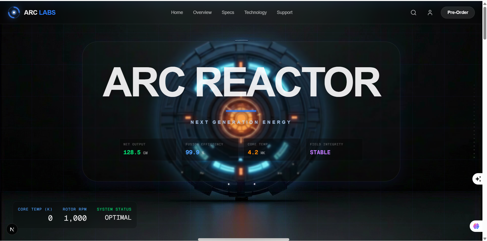

# Arc Reactor - Next Generation Energy ⚛️

A high-performance, visually stunning 3D-animated landing page built with **Next.js**, **Framer Motion**, and **Canvas**. This project features a scroll-driven "exploded view" of a cinematic Arc Reactor core.



## ✨ Features
- **Scroll-Synchronized 3D Animation:** 240+ high-quality frames rendered via HTML5 Canvas for buttery smooth "ping-pong" disassembly and reassembly.
- **Dynamic HUD:** Real-time data overlays (Core Temp, RPM, Power Output) that react to user scroll position.
- **Glassmorphism UI:** Modern, translucent interface built with Tailwind CSS.
- **Smooth Scrolling:** Integrated with Lenis for an elegant scrolling experience.
- **Fully Responsive:** Optimized for both desktop and mobile viewing.

## 🛠️ Tech Stack
- **Framework:** Next.js 15+ (App Router)
- **Animation:** Framer Motion
- **Styling:** Tailwind CSS 4
- **Icons:** Lucide React
- **Deployment:** GitHub Pages (Static Export)

## 📦 Installation & Setup

1. **Clone the repository:**
   ```bash
   git clone https://github.com/tanmoy44717/animated-ark-riacter.git
   cd animated-ark-riacter
   ```

2. **Install dependencies:**
   ```bash
   npm install
   ```

3. **Run the development server:**
   ```bash
   npm run dev
   ```

4. **Build for production:**
   ```bash
   npm run build
   ```

## 📜 Deployment
This project is configured for GitHub Pages. To deploy your own version:
```bash
npm run deploy
```

---
*Created by [tanmoy44717](https://github.com/tanmoy44717)*
